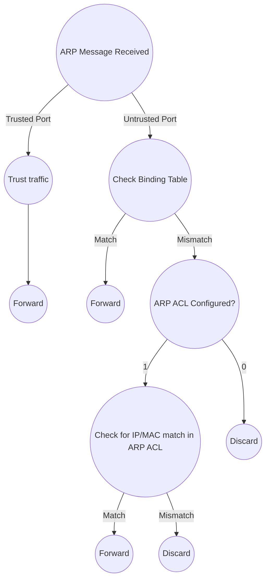

- Gratuitous ARP Message (GARP) = an ARP reply sent without receiving an ARP request
	- Sent to the broadcast MAC address
- Allows devices to learn the MAC address of the sending device without having to send ARP requests
- Sometimes automatically sent when configuration changes are made (interface enabled, IP address changed, MAC address changed, etc.)
# What and How
- Security feature of switches that's used to filter ARP messages received on untrusted ports
	- All ports are untrusted by default
	- Typically, all ports connected to other network devices (switches, routers, etc.) should be set to trusted and all interfaces connected to end hosts should be set to untrusted
- Non-ARP messages aren't affected
- Also supports rate-limiting like DHCP Snooping (default = 15 packets per second)
# Protects Against...
### ARP Poisoning (Man-in-the-Middle)
- Occurs when an attacker sends GARP messages using another device's IP address or replies to ARP Requests
# DAI Inspection Operations

# DAI Optional Checks
- By default, DAI only checks the sender IP and MAC to see if there's a matching entry in the DHCP Snooping Binding Table
- The following additional inspections can be configured with DAI:
	- Destination MAC: validate the destination MAC address in the Ethernet header against the target MAC address in the ARP body for ARP Responses; drop if mismatch
	- IP: validate the IP addresses in the ARP body are not unexpected or invalid; checks the sender IP addresses in all ARP Requests and Responses and checks the target IP addresses only in ARP responses
	- Source MAC: validate the source MAC address in the Ethernet header against the sender MAC address in the ARP body for ARP Responses; drop if mismatch
# Configuration
- Enable DAI with `(config)# ip arp inspection vlan <vlan id>`
- Configure a port as trusted with `(config-if)# ip arp inspection trust`
- View DAI status of each interface with `S# show ip arp inspection interfaces`
- Configure DAI Rate Limiting with `(config-f)# ip arp inspection limit rate <x messages> {burst interval <y seconds>}`
	- This translates to "*Allow X messages every Y seconds*"; default y is 1 if unspecified
- Enable Errdisable Recovery for DAI with `(config)# errdisable recovery cause arp-inspection`
- Check status of Errdisable Recovery with `S# show errdisable recovery`
- Enable additional DAI validation with `(config)# ip arp inspection validate [dst-mac | ip | src-mac]`
	- To enable more than one additional validation method use `(config)# ip arp inspection validate [a b | a c | b a | b c | c a | c b | a b c]`
- Configure an ARP ACL with `(config)# arp access-list <ACL ID>`
	- Configure IP/MAC pairings with `(config-arp-nacl)# permit ip host <IP address> mac host <MAC address>`
- Apply the ARP ACL with `(config)# ip arp inspection filter <ACL ID> vlan <vlan id>`
- View the ARP ACL with `S# show ip arp inspection`
	- If `Static ACL` is set to `Yes`, the implicit deny will be enabled (if this is the case, any pairings not included in the ARP ACL will be denied; this essentially circumvents the DHCP Snooping Binding Table)