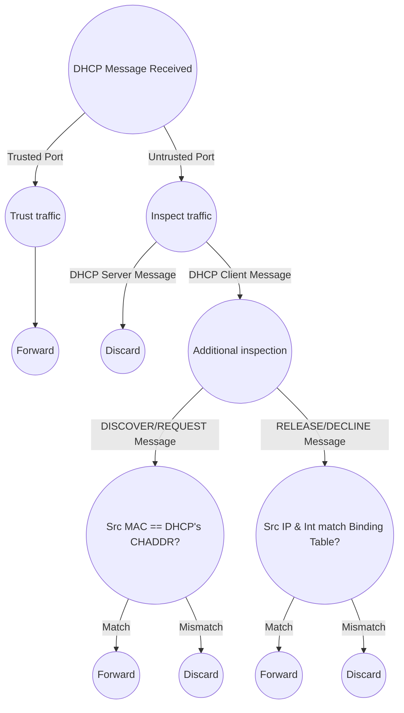

# What and How
- Security feature used to filter [[21. DHCP|DHCP]] messages received on untrusted ports
	- Non-DHCP messages aren't affected
	- All ports are untrusted by default (usually uplink ports are trusted and downlink ports are untrusted)
		- Uplink = ports facing up and out of the network
		- Downlink = ports facing the endhosts
# Protects Against...
### DHCP Starvation
- Occurs when an attacker floods the network with DHCP Discover messages with false MAC addresses, consuming the entirety of the DHCP pool and causing a DoS status
### DHCP Poisoning (Man-in-the-Middle)
- Occurs when a malicious host replies to DHCP Discover messages, assigning the endpoints IP addresses and setting itself up as their default gateway
# DHCP Messages
- When filtering DHCP messages, DHCP snooping differentiates between DHCP Server and DHCP Client messages
- DHCP CHADDR = Source's MAC address as listed in DHCP message
#### DHCP Server Messages:
- OFFER = "Want this IP address?"
- ACK = "Okay, use that IP address"
- NAK = "No, you can't do that"
#### DHCP Client Messages:
- DISCOVER = "I need an IP address, who can give me one?"
- REQUEST = "Yes please, I want that IP address"
- RELEASE = "Okay, I'm done with this IP address"

Remember **DORA** (Discover, Offer, Request, Ack)
# DHCP Snooping Operations

# DHCP Snooping Rate-Limiting
- DHCP Snooping can limit the rate at which DHCP messages are allowed to enter an interface
	- If the rate crosses the limit, the interface is err-disabled
- Err-disabled interface can be manually reenabled or automatically with errdisable recovery
# DHCP Option 82 (Information Option)
- Option 82 = "DHCP Relay Agent Information Option"
	- Provides additional information about which DHCP relay agent received the client's message, on which int, in which VLAN, etc.
- Option 82 can be added to messages forwarded to the remote DHCP server
	- Enabled by default on ALL switches (this presents an issue because, by default, DHCP messages with Option 82 received on an untrusted port are dropped)
- Should only be enabled on DHCP Relay Agents
# Configuration
- Enable DHCP snooping with `(config)# ip dhcp snooping`
	- Enable DHCP snooping on each VLAN (**required**) with `(config)# ip dhcp snooping vlan <vlan id>`
- Disable DHCP Option 82 with `(config)# no ip dhcp snooping information option`
- Configure an interface as trusted with `(config-if)# ip dhcp snooping trust`
	- By default, all ports are untrusted
- View DHCP Snooping Binding Table with `S# show ip dhcp snooping binding`
- Configure DHCP Snooping Rate-Limiting with `(config-if)# ip dhcp snooping limit rate <messages per second>`
- Configure Errdisable Recovery for DHCP Snooping Rate-Limiting with `(config)# errdisable recovery cause dhcp-rate-limit`
